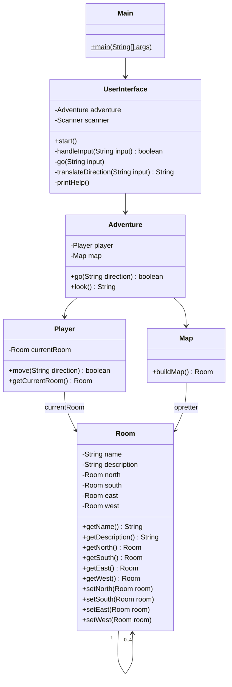

# Klassediagram – Adventure del 1 (refactor)

```mermaid
classDiagram
    class Main {
        +main(String[] args)$
    }
    class UserInterface {
        -Adventure adventure
        -Scanner scanner
        +start()
        -handleInput(String input) boolean
        -go(String input)
        -translateDirection(String input) String
        -printHelp()
    }
    class Adventure {
        -Player player
        -Map map
        +go(String direction) boolean
        +look() String
    }
    class Map {
        +buildMap() Room
    }
    class Player {
        -Room currentRoom
        +move(String direction) boolean
        +getCurrentRoom() Room
    }
    class Room {
        -String name
        -String description
        -Room north
        -Room south
        -Room east
        -Room west
        +getName() String
        +getDescription() String
        +getNorth() Room
        +getSouth() Room
        +getEast() Room
        +getWest() Room
        +setNorth(Room room)
        +setSouth(Room room)
        +setEast(Room room)
        +setWest(Room room)
    }

    Main --> UserInterface
    UserInterface --> Adventure
    Adventure --> Map
    Adventure --> Player
    Player --> Room : currentRoom
    Map --> Room : opretter
    Room "1" --> "0..4" Room
```
